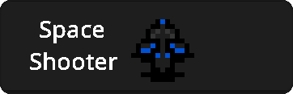

# Space Shooter
[](?tab=readme-ov-file#Space-Shooter)

A game about shooting meteors in Space!

## How to Play
You can play Space Shooter downloading the executable **JAR file** at the [latest release page](https://github.com/notestudios/SpaceShooter/releases/latest).
Or you can play from the source code, the hard way(not that hard to be honest).

## Compiling and Running
This will guide you trough the steps for building the source code of the game.

### Install Dependencies
See the [Development: Dependencies](#Dependencies) section to a guide on how to install them.

### Cloning the Source
You'll have to clone this repository in your computer first to play it.
- Using [Git](https://git-scm.com)
  ```sh
  $ git clone https://github.com/notestudios/SpaceShooter.git
  ```
- Using [GitHub CLI](https://cli.github.com)
  ```sh
  $ gh repo clone notestudios/SpaceShooter
  ```

### Building
After cloning the repo in your computer, you need to build it.
```sh
$ gradle build jar
```
This will build a Java Application Runtime file(java's executable file) in the `build/libs/SpaceShooter.jar` directory.

### Running
You can run the game doing the following:
1. Changing the current directory to the executable's one
  ```sh
  $ cd build/libs
  ```
2. Run the java file, you can double-click in it, or just run this in the terminal:
  ```sh
  $ java -jar SpaceShooter.jar
  ```
Happy Gaming!

## Development

### Dependencies
The game has some dependencies to be installed before compiling it.
| Name | Description |
| - | - |
| [OpenJDK](https://openjdk.org) | The language that the game was written on, basically it makes the game work |
| [Gradle](https://gradle.org) | The tool used to build the game source code |

#### Installing Dependencies
If you're on macOS or any GNU/Linux distribution, you can use [SDKMAN!](https://sdkman.io) to install all the dependencies.
- With [SDKMAN](https://sdkman.io)
  
  ```sh
  $ sdk install gradle
  ```
  ```sh
  $ sdk install java 22-open
  ```
- Manually
  
Follow the instructions in [Gradle Installation Guide](https://gradle.org/installation) and [OpenJDK](https://openjdk.org/).

### Directories
| Name | Description |
| - | - |
| `src/main/java` | Game's source code |
| `src/main/resources` | Game assets(sprites, arts) |
| `build/` | Output directory for game build binaries |
| `build/libs` | Output directory for built jar |
